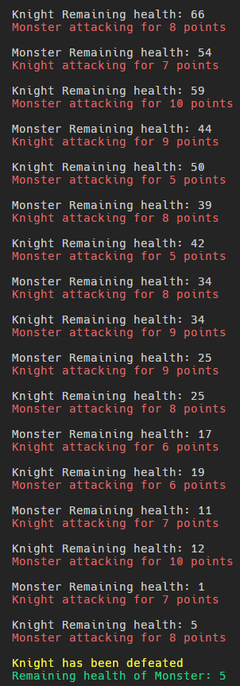

# Assignment 07

[](https://www.python.org/downloads/release/python-3102/)
[](https://conventionalcommits.org)
[PPDS](https://uim.fei.stuba.sk/predmet/i-ppds/)

## Scheduler

We implemented a scheduled which keeps list of tasks with ability to add a new task into its list. In its main loop retreives a task first in queue and sends it calculate a `ret_value` with last `ret_value` passed into the task. Iterations of main loop are kept under a try except, in case a coroutine breaks its iteration and the whole generator is turned off.

```python
mainloop:
    ret_value := 0
    while True:
        try:
            task = tasks.get()
            ret_value := task.send(ret_value)
            tasks.put(task)
        except StopIteration:
            for task in tasks:
                task.close()
            break
```

## Coroutines

We implmented three Coroutines.

1. attack - Coroutine which generates a damage number in range <1, 10> which yields to next task, where it is presumably used to attack an enemy. Coroutine waits for number - remaining health points of previously attacking unit - and a string - name of previously attacking unit - in case of Generator Exit, breaks its loop.

2. knight_turn - Coroutine which yields a remaining health points of its enemy - Monster - and a unit name - Knight. Waits for pseudorandom damage to hit enemy for. Checks if enemys health points are noy <= in which case breaks its loop and generator.

3. monster_turn - Monster which yields a remaining health points of its enemy - Knight - and a unit name - Monster. Waits for pseudorandom damage to hit enemy for. Checks if enemys health points are noy <= in which case breaks its loop and generator.

Attack Coroutine:

```python
attack():
    while True:
        try:
            damage := random<1, 10>
            remaining_hp, unit_name := (yield damage)
            print(f'{unit_name} Remaining health: {remaining_hp}')

        except GeneratorExit:
            break
```

Unit Coroutine (Knight/Monster):

```python
unit_turn():
    unit_hp := 100
    while True:
        try:
            dmg := (yield (unit_hp, unit_name))

            print(f'Monster attacking for {dmg} points')

            unit_hp -= dmg

            if(knight_hp <= 0):
                break

        except GeneratorExit:
            print(f'\nMonster has been slain')
            print(f'Remaining health of Knight: {knight_hp}')
            break
```

## Returning Console Print

This printout is prettified and shortened

