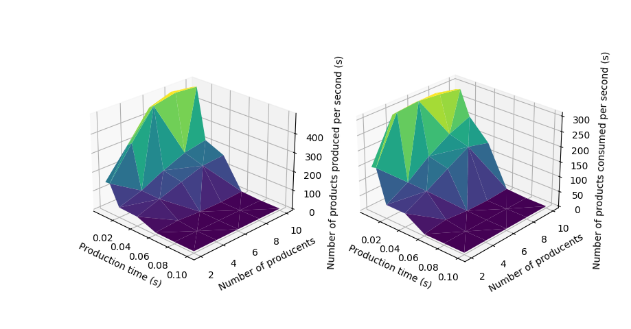

# Assignment 03

[PPDS](https://uim.fei.stuba.sk/predmet/i-ppds/)

## Optimalization of Producer-Consumer problem

We chose to solve optimalization problem of Producer-Consumer. Where it is crucial to provide consistency of access to storage where items are sotred. Producer produces items during `production time` and stores it in shared storage, that needs to be protected by shared `Mutex` lock. Consumer takes item from storage and processes it during `process time`.

### First iteration of parameters

In the first iteration we changed the `production time` parameter and number of `consumer`s.
Set parameters:

1. production times - [0.005, 0.01, 0.02, 0.04, 0.06, 0.08, 0.1]
2. consumers - [2, 4, 6, 8, 10]
3. storage - 10
4. producers - 8
5. process time - 0.004
6. sleep time - 0.05

On the graph we can notice that with decreasing `production time` number of products produced per time increases. `Production time` correlated to number of `consumers` is negligible in higher production times. In lover times, around 0.02 second we can see that number of `products produced` per second is lower with lower numebr of `consumers`. This phenomenon is caused by the fact that `producer`s don't have to wait for `consumer`s to finish processing when more `consumer`s process.

### Second iteration of parameters

In the second iteration we changed the `process time` parameter and number of `producer`s.
Set parameters:

1. production time - 0.04
2. consumers - 4
3. storage - 10
4. producers - [2, 4, 6, 8, 10]
5. process time - [0.001, 0.002, 0.004, 0.006, 0.008]
6. sleep time - 0.05

Similarly to first iteration we noticed that more `producer`s mean more products being produced. Also that `process time`s don't play a role in faster production in lower numbers of producents. We can notice in higher numbers of producents higher process times mean lower numbers of products being produced.

### Third iteration of parameters

In the third iteration we changed the `production time` parameter and number of `producer`s.
Set parameters:

1. production time - [0.005, 0.01, 0.02, 0.04, 0.06, 0.08, 0.1]
2. consumers - 4
3. storage - 10
4. producers - [2, 4, 6, 8, 10]
5. process time - 0.004
6. sleep time - 0.05

In third interation we noticed that `production time`s higher than `0.04` have bad effect on number of products produced in a way that no products are being produced. We also confirmed that lower number of producers mean few products.

### Fourth iteration of parameters

In last iteration we changed the `production time` paramete and `storage` capacity.
Set parameters:

1. production time - [0.005, 0.01, 0.02, 0.04, 0.06, 0.08, 0.1]
2. consumers - 4
3. storage - [5, 10, 15, 20]
4. producers - 8
5. process time - 0.004
6. sleep time - 0.05

With higher capacity we noticed highest numbers of products being produced when production time is at its lowest, around 0.02s. But we can see that number of product consumed are lower than in the first interation. Which means products are being stored and not processed by consumers.

